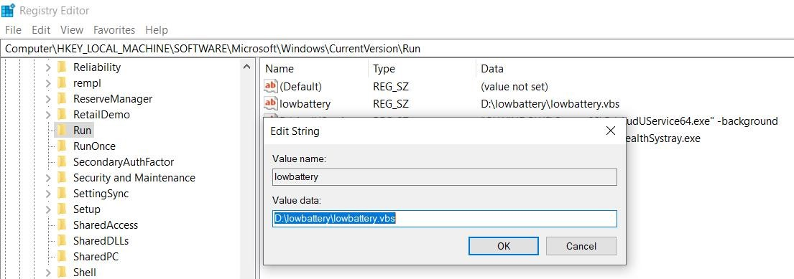

# LowBatteryNotify
## This application is used to notify me to charge my laptop when the battery level is below 40%.

- Using win10toast to create notifications in Windows
- psutil is used to monitor the battery level
- automatically start programs whenever Windows launches

---

## Environment:
- Windows 10
- Python 3.10.4
- psutil 5.8.0
- win10toast 0.9

## Installation
Install the python packages
```bat
pip install psutil==5.8.0
pip install win10toast==0.9
```

To make the Program Run at Windows Startup
Open your registry and find the key:
[HKEY_LOCAL_MACHINE\Software\Microsoft\Windows\CurrentVersion\Run]

Create a new string value using a descriptive name, and set the value of the string to the program executable.

Set "lowbattery"="D:\lowbattery\lowbattery.vbs".


Change the path in lowbattery.vbs, lowbattery.bat

---

## Version
### Check the version of python
```cmd
python --version
```

### List all the python packages using pip
```cmd
pip list
pip show psutil win10toast
```

---

## Reference
For mac: 
https://medium.com/@mingjunlu/how-to-monitor-your-laptops-battery-and-send-notifications-at-certain-percentages-with-python-c24199d1f83e
